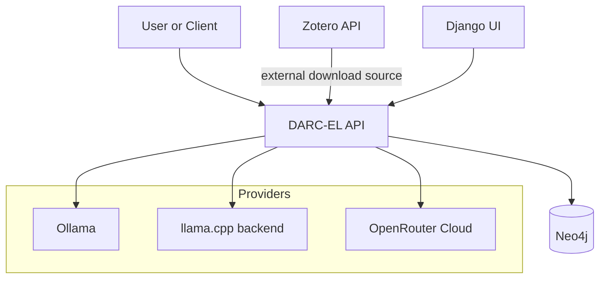
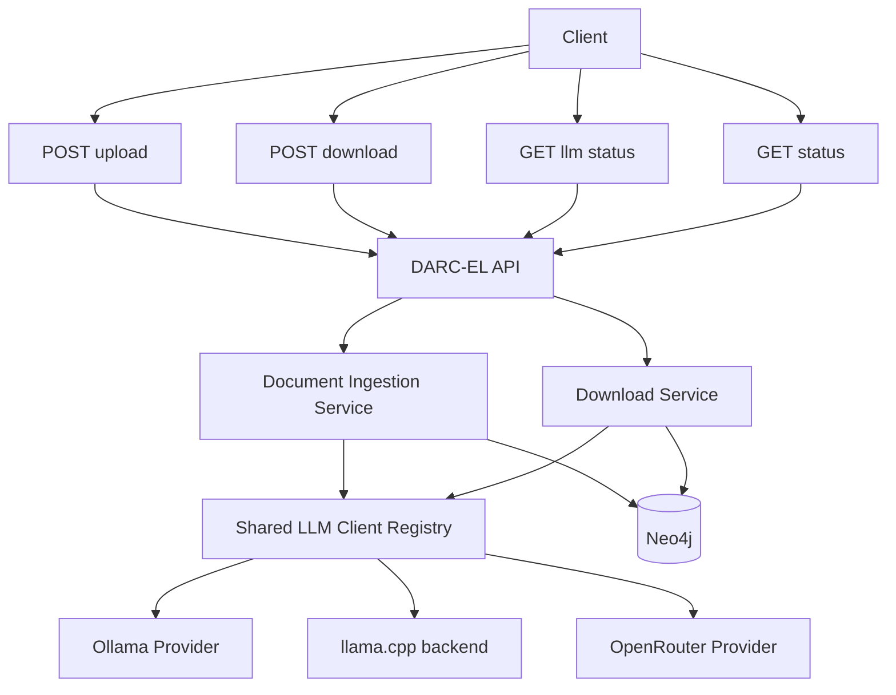

# DARC-EL: LLM-Based Data Extraction for Assessing Reporting Completeness in Electrocatalysis Literature

DARC-EL Data-driven Assessment of Reporting Completeness in Electrocatalysis Literature

## Project Description

Reliable evaluation of electrocatalysts requires consistent reporting of key properties such as activity, overpotential, and long-term stability, yet these metrics are frequently incomplete or inconsistently documented in the literature. This project's goal is to develop a GenAI-powered automated pipeline to systematically analyze a large body of electrocatalysis literature, extract key properties, and quantify how often essential information is missing. A benchmark on prompt-engineered and retrieval-augmented LLM approaches using a ground-truth dataset will be done, then the best-performing method will be applied to a broad corpus of papers. The system identifies underreporting trends and variations across journals and publication years, providing data-driven insights into the evolution of reporting practices in electrocatalysis.

The API now also accepts document uploads for ingestion into Neo4j. Uploaded files are parsed by type, extracted into a transport object, chunked for later retrieval, and stored as separate graph nodes.

## Author

- Roland Ramp
- ORCID: [0009-0003-5145-2197](https://orcid.org/0009-0003-5145-2197)

## License

This project is licensed under the MIT License. See [LICENSE](LICENSE).

## Prerequisites

- Docker installed and running
- Docker Compose v2 (`docker compose`) or the legacy `docker-compose` command
- A valid Zotero API key and library ID
- Neo4j runs as part of the compose stack at `bolt://neo4j-kg:7687`

## Project Structure

- `darc-el-backend/` contains the FastAPI backend, its `pyproject.toml`, and backend Dockerfile
- `darc-el-ui/` contains the Django web UI, its `pyproject.toml`, and UI Dockerfile
- `docker-compose.yml` builds and runs backend + UI together with Neo4j and LLM providers
- `.env` stores runtime environment variables
- `.env.example` provides a safe template without secrets

## System Architecture

DARC-EL runs as a service-oriented API that orchestrates bibliography downloads, document ingestion, and LLM provider routing through a shared registry configured in `config/llm_models.yaml`.



The runtime flow below shows how API endpoints map to internal services, shared LLM routing, and graph persistence.



## 1. Configure Environment Variables

Copy `.env.example` to `.env` and set your own values:

ZOTERO_LIBRARY_ID=your_library_id
ZOTERO_API_KEY=your_api_key
ZOTERO_LIBRARY_TYPE=group

Optional:

ZOTERO_OUTPUT_FILE=zotero_group_items.json

LLM model registration is now read from `config/llm_models.yaml`. Keep model names and provider-model mappings in that YAML file.
You can also register an optional OpenRouter model in the same YAML using `provider: openrouter` and `api_key: ${OPENROUTER_API_KEY}`.

## 2. Build with Docker Compose

From the project root, build the services:

```bash
docker compose build
```

To build only the backend service:

```bash
docker compose build darc-el
```

To build only the UI service:

```bash
docker compose build darc-el-ui
```

## 3. Run the Stack

Start the full stack:

```bash
docker compose up
```

Or run only the application service:

```bash
docker compose up darc-el
```

Or run only the UI service:

```bash
docker compose up darc-el-ui
```

If you want to rebuild before starting:

```bash
docker compose up --build
```

To recreate the service:

```bash
docker compose up -d --build --force-recreate darc-el
```

To start up everthing with GPU:

```bash
docker compose --profile gpu up -d
```

## 4. Verify Output

After the service runs a download, check the generated JSON file in your project directory.

Default output file:

zotero_group_items.json

## Access the Services

- DARC-EL API: http://localhost:8000
- DARC-EL UI (Django): http://localhost:8081
- Neo4j Browser: http://localhost:7474
- Neo4j Bolt: bolt://localhost:7687
- Ollama API: http://localhost:6543

## Shared LLM Clients

The application initializes a shared OpenAI-compatible client registry at startup. Clients are registered by model name from `config/llm_models.yaml`, where each model entry defines provider and base URL.
For `openrouter` providers, the service uses the dedicated OpenRouter SDK client path during registration.

Start the backend app with `python darc-el-backend/src/main.py --llm-config-path config/llm_models.yaml`.
Start the UI app with `python darc-el-ui/manage.py runserver 0.0.0.0:8081`.

Use `GET /llm/status` to inspect non-secret client configuration and initialization state.

## Document Uploads

Use `POST /upload` with `multipart/form-data` and one or more files in the `files` field.

Supported types in this implementation:

- PDF
- DOCX
- plain text

The API extracts text and metadata, chunks the text, and writes the result to Neo4j as:

- one `Document` node per file
- one `DocumentMetadata` node per file
- one `DocumentChunk` node per chunk

The current Neo4j connection used by the app inside Docker is `bolt://neo4j-kg:7687`, with credentials controlled by `NEO4J_USER` and `NEO4J_PASS`.

## Notes

- Keep `.env` private. Do not commit real API keys.
- Dependencies are installed from `pyproject.toml` during image build.
- The DARC-EL container is started by the Dockerfile `CMD` and the compose service definition.
- Neo4j downloads its plugins during image build, so there is no host-mounted plugin directory anymore.

## Static Analysis

This project uses Ruff for Python static code analysis and linting.

Install development dependencies:

```bash
pip install -e .[dev]
```

Run lint checks:

```bash
make lint
```

Run lint with auto-fixes:

```bash
make lint-fix
```


## Test file upload

```powershell
Set-ExecutionPolicy -Scope Process -ExecutionPolicy Bypass -Force
.\test-upload-pdf.ps1 -PdfPath "C:\Users\rolan\interdisciplinary project\data\10.1002_adfm.202107862.pdf"
```