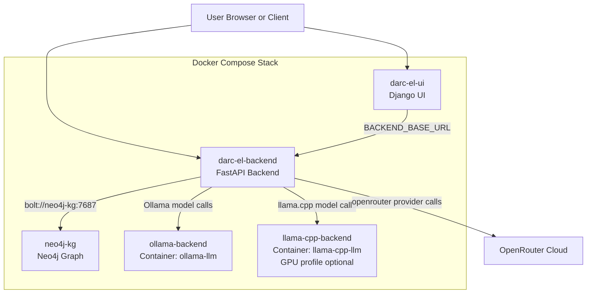
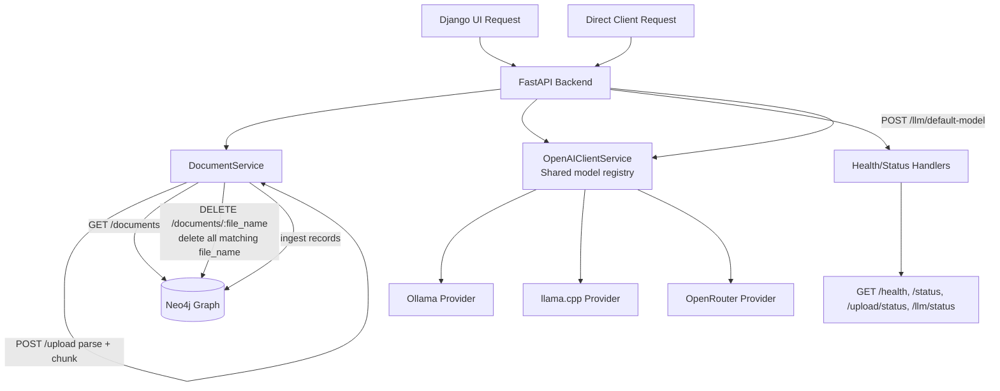

# DARC-EL: LLM-Based Data Extraction for Assessing Reporting Completeness in Electrocatalysis Literature

DARC-EL Data-driven Assessment of Reporting Completeness in Electrocatalysis Literature

## Project Description

Reliable evaluation of electrocatalysts requires consistent reporting of key properties such as activity, overpotential, and long-term stability, yet these metrics are frequently incomplete or inconsistently documented in the literature. This project's goal is to develop a GenAI-powered automated pipeline to systematically analyze a large body of electrocatalysis literature, extract key properties, and quantify how often essential information is missing. A benchmark on prompt-engineered and retrieval-augmented LLM approaches using a ground-truth dataset will be done, then the best-performing method will be applied to a broad corpus of papers. The system identifies underreporting trends and variations across journals and publication years, providing data-driven insights into the evolution of reporting practices in electrocatalysis.

The API now also accepts document uploads for ingestion into Neo4j. Uploaded files are parsed by type, extracted into a transport object, chunked for later retrieval, and stored as separate graph nodes.

Backend implementation details, API endpoint behavior, and upload internals are documented in `darc-el-backend/README.md`.
UI runtime, Django configuration, and frontend integration details are documented in `darc-el-ui/README.md`.

## Author

- Roland Ramp
- ORCID: [0009-0003-5145-2197](https://orcid.org/0009-0003-5145-2197)

## License

This project is licensed under the MIT License. See [LICENSE](LICENSE).

## Prerequisites

- Docker installed and running
- Docker Compose v2 (`docker compose`) or the legacy `docker-compose` command
- A configured `.env` file for backend, UI, Neo4j, and optional LLM provider keys
- Neo4j runs as part of the compose stack at `bolt://neo4j-kg:7687`

## Project Structure

- `darc-el-backend/` contains the FastAPI backend, its `pyproject.toml`, and backend Dockerfile
- `darc-el-ui/` contains the Django web UI, its `pyproject.toml`, and UI Dockerfile
- `docker-compose.yml` builds and runs backend + UI together with Neo4j and LLM providers
- `.env` stores runtime environment variables
- `.env.example` provides a safe template without secrets

## Service Documentation

- Backend service documentation: [`darc-el-backend/README.md`](darc-el-backend/README.md)
- UI service documentation: [`darc-el-ui/README.md`](darc-el-ui/README.md)

## Current Functional Focus

- UI pages for home, monitor, document management, and model interaction
- Document upload parsing, chunking, Neo4j ingestion, and document deletion workflows
- Prompting through the default-model endpoint with provider routing via the shared model registry
- Runtime observability through health and status endpoints exposed to the UI

## System Architecture

DARC-EL runs as a compose-managed multi-service stack. The backend orchestrates document upload and ingestion, document management operations, and LLM provider routing through a shared registry configured in `config/llm_models.yaml`, while the Django UI consumes backend APIs for monitoring and interaction workflows.

The diagram below shows the deployment topology and service boundaries.



The runtime flow below summarizes how backend services process requests, route LLM calls, and persist graph data.



Backend API endpoint details and upload internals are maintained in `darc-el-backend/README.md`.
UI runtime and integration behavior are maintained in `darc-el-ui/README.md`.

## 1. Configure Environment Variables

Copy `.env.example` to `.env` and set the runtime values for the UI and backend services:

NEO4J_USER=neo4j
NEO4J_PASS=your_neo4j_password
NEO4J_URI=bolt://neo4j-kg:7687
PDF_ZLIB_MAX_OUTPUT_LENGTH=200000000

Optional provider keys:

OPEN_ROUTER_API_KEY=
ANTHROPIC_API_KEY=
OPENAI_API_KEY=

The UI container uses `BACKEND_BASE_URL=http://darc-el-backend:8000` by default in `docker-compose.yml`.
LLM model registration is read from `config/llm_models.yaml`; keep provider-model mappings in that YAML file.

## 2. Build with Docker Compose

From the project root, build the services:

```bash
docker compose build
```

For service-specific build commands, see the backend and UI README files.

## 3. Run the Stack

Start the full stack:

```bash
docker compose up
```

If you want to rebuild before starting:

```bash
docker compose up --build
```

To start up everthing with GPU:

```bash
docker compose --profile gpu up -d
```

## 4. Verify Output

After starting the stack, verify UI and service functionality:

1. Open the UI at `http://localhost:8081` and confirm pages load for home, monitor, document, and model views.
2. Confirm backend health at `http://localhost:8000/health`.
3. Upload one or more files from the document page and verify the response reports `completed` or `partial` with per-file outcomes.
4. Confirm ingested records via `GET /documents` and test deletion from the UI.
5. Optionally validate upload progress via `GET /upload/status` and model status via `GET /llm/status`.

## Access the Services

- DARC-EL API (FastApi): http://localhost:8000
- DARC-EL UI (Django): http://localhost:8081
- Neo4j Browser: http://localhost:7474
- Neo4j Bolt: bolt://localhost:7687
- Ollama API: http://localhost:6543

For backend endpoints, LLM client configuration, upload behavior, linting, and upload test scripts, see [`darc-el-backend/README.md`](darc-el-backend/README.md).

For UI local runtime and integration settings, see [`darc-el-ui/README.md`](darc-el-ui/README.md).

## Notes

- Keep `.env` private. Do not commit real API keys.
- Dependencies are installed from each service's `pyproject.toml` during image build.